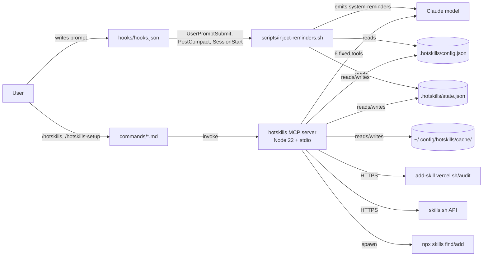

# ADR-001: Plugin + MCP server foundation

**Date:** 2026-04-23
**Status:** Accepted
**Decision makers:** liam.helmer@gmail.com (user), local subagent, star-chamber (3× openai providers)

## Context

Hotskills must ship as something a Claude Code user can install in one step and start using. The product needs both a UI surface (slash commands, hooks) and a service surface (search, activation, dispatcher) that survives session boundaries. This ADR fixes the foundational shape: distribution unit, runtime, transport, and tool surface.

Three constraints drove the choice:
1. **Claude Code does NOT honor MCP `notifications/tools/list_changed`** (refs: anthropics/claude-code#13646, #4118, #2722). True dynamic tool registration mid-session is impossible today.
2. **Inline `mcpServers` in `plugin.json` is silently dropped** (anthropics/claude-code#16143). Use `.mcp.json`.
3. **`vercel-labs/skills` is Node** — server runtime alignment matters for vendor-module reuse.

## Decision

Hotskills ships as a **single Claude Code plugin** containing a **bundled local MCP server**. The server runs as a Node child process over stdio transport, declared in `.mcp.json` at plugin root. Six fixed MCP tools are registered at connect; activation is metadata-only (no dynamic tool registration).

## Requirements (RFC 2119)

- The plugin MUST declare its MCP server in `.mcp.json` at plugin root, NOT inline in `plugin.json` (anthropics/claude-code#16143).
- The MCP server MUST use `StdioServerTransport` (not SSE; not HTTP).
- The MCP server MUST register exactly these six tools at connect time, with no expectation that additional tools become available mid-session: `hotskills.search`, `hotskills.activate`, `hotskills.deactivate`, `hotskills.list`, `hotskills.invoke`, `hotskills.audit`.
- Skill identity MUST be a fully-qualified string of the form `<source>:<owner>/<repo>:<slug>` (e.g., `skills.sh:vercel-labs/agent-skills:react-best-practices`).
- The plugin MUST ship `commands/hotskills.md` and `commands/hotskills-setup.md` slash commands.
- The plugin MUST ship `hooks/hooks.json` declaring `PostCompact`, `SessionStart`, and `UserPromptSubmit` handlers.
- The MCP server MUST target Node.js 22 LTS or later (NOT Node 20).
- The MCP server MUST pin `@modelcontextprotocol/sdk` to `^1.29.0` (NOT v2.x pre-alpha).
- The MCP server MUST expose its config directory via `HOTSKILLS_CONFIG_DIR` env var (default `${HOME}/.config/hotskills`).
- The MCP server MUST expose the project root via `HOTSKILLS_PROJECT_CWD` (sourced from `${CLAUDE_PROJECT_DIR}` in `.mcp.json`).
- The plugin MUST use `${CLAUDE_PLUGIN_ROOT}` in `.mcp.json` paths (never absolute paths).
- The MCP server MUST NOT register tools beyond the six listed without an updated ADR.

## Rationale

- **Single plugin + bundled server:** the user invokes one install. Splitting plugin and server creates a setup tax with no offsetting benefit.
- **Stdio:** SSE is deprecated upstream; HTTP is for remote servers. Stdio is the documented path for plugin-bundled local MCP servers.
- **Six fixed tools:** matches the dispatcher decision in ADR-003 and works around `list_changed` being unhonored. Each tool maps to one verb users (or the LLM) reason about.
- **Node 22 LTS + SDK ^1.29.0:** Node 20 enters maintenance 2026-04-30; v2 of the SDK is pre-alpha. Both are conservative defaults for production.
- **Fully-qualified skill IDs:** prevents the multi-source name-collision problem identified in research.

## Alternatives Considered

### Plugin-only, no MCP server (everything in commands + hooks)
- Pros: simpler distribution; no Node child process.
- Cons: cannot offer LLM-callable tools; loses dispatcher; no shared cache; no deterministic activation lifecycle.
- Why rejected: kills the user-stated requirement that the LLM can invoke skill discovery itself.

### Two-package distribution (plugin + standalone CLI)
- Pros: server reusable outside Claude Code.
- Cons: install friction; two upgrade paths.
- Why rejected: zero v0 users want it standalone; revisit when there's demand.

### Python server (mirroring intellectronica/skillz)
- Pros: prior art; mature Python MCP SDK.
- Cons: Python runtime dependency on a Claude Code plugin (Claude Code is Node); cannot reuse vercel-labs/skills modules.
- Why rejected: distribution friction wins out.

## Assumed Versions (SHOULD)

- Node.js: 22 (Jod) LTS — through 2027-04-30
- `@modelcontextprotocol/sdk`: ^1.29.0
- TypeScript: 5.x
- Claude Code plugin manifest: per https://code.claude.com/docs/en/plugins-reference (no numeric spec version)

## Diagram

<!-- Mermaid source inline; SVG generation deferred to /brains:diagram if needed. -->

Mermaid source

## Consequences

- All other ADRs in this set MAY assume the six-tool surface, the stdio transport, the `.mcp.json` declaration, and the env-var contract.
- Any future need for additional tools (e.g., a Resources surface for the Skills-Over-MCP WG draft) requires a new ADR.
- A v2 SDK migration ADR is deferred until v2 stable ships.

### Phase 0 verification items (load-bearing assumptions to smoke-test)

- Confirm `${CLAUDE_PROJECT_DIR}` resolves to the user's project root in `.mcp.json` env.
- Confirm `${CLAUDE_PLUGIN_ROOT}` resolves to the plugin install root.
- Confirm the MCP server's stdio process is started by Claude Code on first plugin load.

## Council Input

Star-chamber consensus: "directionally strong but multiple load-bearing assumptions treated as settled facts." Specific assumptions flagged: hook stdout injection semantics (addressed in ADR-005), `npx skills add --target` behavior (addressed in ADR-002), audit API schema stability (addressed in ADR-004 by pinning vendored types). Strict-v0 recommendation accepted: deferred items moved to "v1" in each ADR rather than expanded in v0.
