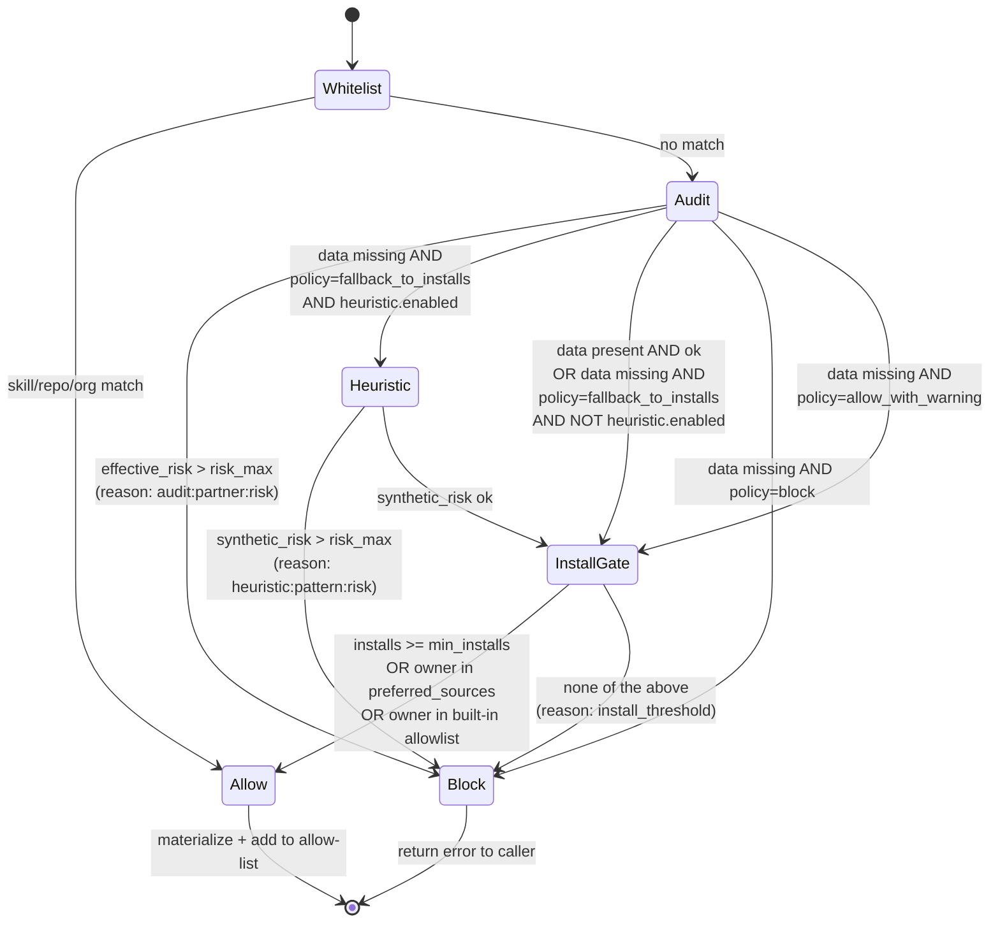

# ADR-004: Security gating policy v0

**Date:** 2026-04-23
**Status:** Accepted
**Decision makers:** liam.helmer@gmail.com (user), local subagent, star-chamber

## Context

The user's stated requirement: *"only activate skills by default if they pass a certain threshold: minimum 1k installs, maximum security risk scope of medium. These will be configurable. Allow whitelisting of certain orgs or repositories, so that the skills in those orgs or repositories are automatically allowed to be added, and skip security checks."*

Initial research (incorrectly) concluded skills.sh exposes no security-rating API. The user identified the missing surface: `vercel-labs/skills/src/telemetry.ts:97 fetchAuditData` calls `https://add-skill.vercel.sh/audit?source=<owner/repo>&skills=<csv-of-slugs>`. The endpoint is real and returns full per-skill `risk: safe|low|medium|high|critical|unknown` data across 4 partners (Gen Agent Trust Hub, Socket, Snyk, Zeroleaks). Smoke-tested 2026-04-23.

This ADR locks the v0 gate stack. Heuristic scanning for the no-audit-data tail of the corpus is included as opt-in (the user chose option B at the questionnaire gate).

## Decision

A four-layer gate stack runs at activation time, in order, with the first deny short-circuiting:

1. **Whitelist** (skills/repos/orgs) → ALLOW (the user's "skip security checks" semantic)
2. **Audit gate** — fetch from `add-skill.vercel.sh/audit`, take max-of-partners risk, block if `> risk_max` (default `medium`)
3. **Heuristic gate** (only when `heuristic.enabled: true`) — static scan of SKILL.md + scripts/, synthetic risk vs. `risk_max`
4. **Install + author gate** — `installs >= min_installs` OR source in `preferred_sources` OR source in built-in `audited_authors_allowlist`

Audit responses cached 24h. Audit schema pinned to vendored types from `vercel-labs/skills/src/telemetry.ts` (per ADR-002).

## Requirements (RFC 2119)

### Audit API

- The server MUST call the audit API at `https://add-skill.vercel.sh/audit?source=<owner>/<repo>&skills=<csv-of-slugs>` for skills.sh and `github`-typed sources.
- The server MUST use the timeout `3000ms` (matching upstream default); on timeout MUST treat as no-data.
- The server MUST cache audit responses at `${HOTSKILLS_CONFIG_DIR}/cache/audit/<owner>-<repo>.json` for 24h.
- The server MUST validate audit responses against the vendored `AuditResponse` type schema; malformed responses MUST be treated as no-data.

### Risk severity ordering

- Severity ordering MUST be: `safe < low < medium < high < critical < unknown`. The `unknown` value MUST be treated as worst-case (i.e., never auto-allowed).
- Multi-partner conflict resolution MUST be max-of-partners (worst signal wins). This MUST be configurable via `security.audit_conflict_resolution` with values `max` (default), `mean`, `majority` — but only `max` is implemented in v0; other values MUST return a config-validation error.

### Gate stack

The gate stack MUST execute in the following order at activation time. The first BLOCK short-circuits.

1. **Whitelist:** if `skill_id` matches `security.whitelist.skills`, OR `owner` matches `security.whitelist.orgs`, OR `owner/repo` matches `security.whitelist.repos`, the gate MUST return ALLOW. Whitelist matches MUST log a one-line audit entry to `${HOTSKILLS_CONFIG_DIR}/logs/whitelist-activations.log` with skill_id, scope (project/global), timestamp, and matching whitelist entry.
2. **Audit gate:** fetch audit; compute `effective_risk = max-by-severity(partner.risk for partner in security.audit_partners)`. If audit returned data and `effective_risk > security.risk_max`, MUST return BLOCK with reason `audit:<partner>:<risk>`. If audit returned no data (`{}` or fetch failed), MUST apply `security.no_audit_data_policy`:
   - `fallback_to_installs` (default) — continue to step 3
   - `block` — MUST return BLOCK with reason `no_audit_data:blocked`
   - `allow_with_warning` — MUST continue and surface warning in the picker
3. **Heuristic gate** (only when `security.heuristic.enabled: true`):
   - Scan `SKILL.md` `allowed-tools` frontmatter and `scripts/` directory contents for enabled patterns:
     - `broad_bash_glob`: `Bash(*)`, `Bash(**)`, `Bash` without explicit allowed-list
     - `write_outside_cwd`: `Write` paths starting with `/`, `~`, or containing `..`
     - `curl_pipe_sh`: regex `curl[^|]*\|\s*(sh|bash|zsh)`
     - `raw_network_egress`: regex `(curl|wget|nc|netcat|fetch)\s+https?://`
   - Map findings to synthetic risk: 0 patterns = `low`, 1 pattern = `medium`, 2+ patterns = `high`.
   - If `synthetic_risk > security.risk_max`, MUST return BLOCK with reason `heuristic:<pattern>:<risk>`.
4. **Install + author gate:**
   - Allow if `installs >= security.min_installs` (default 1000)
   - OR `owner` in `security.preferred_sources`
   - OR `owner` in built-in `audited_authors_allowlist`: `anthropics`, `vercel-labs`, `microsoft`, `mastra-ai`, `remotion-dev`
   - Otherwise MUST return BLOCK with reason `install_threshold:<installs><min_installs>`

### Whitelist override surface

- Whitelist additions MUST be made via either: (a) editing `config.json` directly, (b) `/hotskills` picker with `--whitelist <skill_id>` flag (which appends to project whitelist after a confirmation prompt), or (c) global config edit.
- The picker MUST display a clear warning before adding to whitelist: which skill, what risk it is currently flagged at, and that all gates (including audit) will be skipped.
- Whitelist matches MUST be logged (see step 1 above).

### Heuristic results labeling

- When the heuristic produces a risk, the picker and `hotskills.audit` response MUST label it with `source: "heuristic"` to distinguish from real audit data.
- Heuristic risk MUST never override real audit data; the audit gate runs first and short-circuits on BLOCK.

### Schema (in `<project>/.hotskills/config.json` and global)

```json
{
  "security": {
    "risk_max": "medium",
    "min_installs": 1000,
    "audit_partners": ["ath", "socket", "snyk", "zeroleaks"],
    "audit_conflict_resolution": "max",
    "no_audit_data_policy": "fallback_to_installs",
    "preferred_sources": [],
    "whitelist": { "orgs": [], "repos": [], "skills": [] },
    "heuristic": {
      "enabled": false,
      "patterns": {
        "broad_bash_glob": true,
        "write_outside_cwd": true,
        "curl_pipe_sh": true,
        "raw_network_egress": true
      }
    }
  }
}
```

### Failure modes

- Audit fetch timeout (>3s): treat as no-data.
- Audit API returns non-2xx: treat as no-data, log to `${HOTSKILLS_CONFIG_DIR}/logs/audit-errors.log`.
- Audit cache file corrupted: discard, re-fetch.
- Heuristic regex DoS: each pattern MUST have a 100ms execution timeout per file.

## Rationale

- **Audit API gives a real, per-skill multi-partner signal.** The user's literal "max medium risk scope" requirement is implementable as stated.
- **Multi-partner max-of:** safer default than mean/majority. A skill where one partner reports high risk shouldn't be allowed by majority vote of safer-leaning partners.
- **Whitelist as escape hatch logged to disk:** matches the user's "skip security checks" requirement while leaving an audit trail for incident review.
- **Heuristic opt-in:** avoids false-positive backlash on launch. v0 ships with `enabled: false`; teams that want the extra layer turn it on.
- **`audited_authors_allowlist` built-in:** trusted vendors (anthropics, vercel-labs, microsoft, mastra-ai, remotion-dev) bypass install-count threshold but NOT audit gate. They're the audited subset on `/audits` page so they generally have audit data anyway.

## Alternatives Considered

### A — No heuristic, just audit + install + whitelist
- Pros: simpler; less surface to test.
- Cons: ~99.9% of skills have no audit data; install count alone is gameable.
- Why rejected: user chose B at the questionnaire gate.

### C — Interactive confirmation on no-audit-data
- Pros: human-in-the-loop strictness.
- Cons: kills `--auto` and opportunistic flows.
- Why rejected: user wants opportunistic mode usable.

### Drop `risk_max` entirely; only allow whitelist
- Pros: maximum strictness.
- Cons: defeats skills.sh discovery.
- Why rejected: too restrictive for the stated UX.

### Run heuristic ALWAYS, on top of audit
- Pros: defense in depth.
- Cons: false positives on legitimate Bash-using skills; user trust erodes.
- Why rejected: opt-in is the right v0 default.

## Assumed Versions (SHOULD)

- `add-skill.vercel.sh/audit` schema: as observed 2026-04-23 (vendored as `vercel-labs/skills/src/telemetry.ts:80-89`)
- Audit partners observed: `ath`, `socket`, `snyk`, `zeroleaks` (any new partner in responses MUST be ignored unless present in `security.audit_partners`)

## Diagram

<!-- Mermaid source inline; SVG generation deferred to /brains:diagram if needed. -->

<details><summary>Mermaid source — security gate state machine</summary>



</details>

## Consequences

- ADR-003's `hotskills.activate` flow plugs in this gate stack as a synchronous step before materialization.
- ADR-002's audit-cache TTL (24h) is locked here.
- Surfacing `gate_status` and `audit` in `hotskills.search` results (per ADR-003) lets the picker show why a skill would or would not activate.
- Whitelist log file gives a clear audit trail; useful for security incident review.

### Phase 0 verification items

- Smoke-test audit endpoint with diverse skills (audited and unaudited) and confirm response shape matches vendored types.
- Smoke-test heuristic patterns on a sample of 20 popular SKILL.md files; tune false-positive rate before turning on for users.
- Confirm `${HOTSKILLS_CONFIG_DIR}/logs/whitelist-activations.log` is appended atomically (no log loss under concurrent activations).

## Council Input

Star-chamber flagged "ambiguous override and trust boundaries" and "are there bypass paths?" — addressed by: (a) explicit ordered gate stack with documented short-circuit semantics; (b) whitelist activations logged to disk; (c) explicit confirmation prompt in picker for `--whitelist` additions; (d) heuristic results labeled `source: "heuristic"` so users can distinguish them from real audits; (e) `unknown` risk treated as worst-case so partners returning unrecognized values cannot accidentally allow.
