# ADR-005: Opportunistic mode and compaction-survival hooks

**Date:** 2026-04-23
**Status:** Accepted (amended 2026-04-28 — see Amendment 1)
**Decision makers:** liam.helmer@gmail.com (user), local subagent, star-chamber

## Context

Two coupled concerns:

1. **Opportunistic mode (Q4):** the user wants the first prompt after a context refresh/compaction to automatically run a skills search based on the prompt content. Hooks (`PostCompact`, `SessionStart`) are shell commands that cannot directly call MCP tools. The chosen approach (Q4.B) is for hooks to set a `pending` flag in `state.json`, and a `UserPromptSubmit` hook to inject a system reminder telling the model to call `hotskills.search` if relevant.
2. **Compaction-survival (raised by user mid-questionnaire):** *"do we need to do anything to make sure that after a compaction or clear context that the skills that are activated for the project are available?"* Activated-skill identity persists on disk in `.hotskills/config.json`, but the **model's awareness** of which skills are activated lives in turn context (the system reminder) and is wiped by compaction/clear. Without a fix, the model loses awareness for one or more turns until a UserPromptSubmit hook fires.

This ADR fixes both.

## Decision

A single shared script `scripts/inject-reminders.sh` is invoked from three hook events: `PostCompact`, `SessionStart`, and `UserPromptSubmit`. The script reads `<project>/.hotskills/config.json` (activated list) and `<project>/.hotskills/state.json` (opportunistic flag) and emits up to two `<system-reminder>` blocks to stdout — which Claude Code injects into the model's context.

This guarantees activated skills are visible to the model immediately after compaction or session start, and that opportunistic-search nudges fire once per refresh event.

## Requirements (RFC 2119)

### Hook declarations (`hooks/hooks.json`)

> **NOTE:** The shape originally specified in this section was guesswork and does not match Claude Code's hook loader. **Amendment 1 (2026-04-28)** at the bottom of this ADR supersedes this snippet with the real on-disk format. Implementations MUST use the Amendment 1 format. The original snippet is preserved here only for historical context.

The plugin MUST declare exactly these three hook handlers, all invoking the same script with different `--event` flags. **Use the format from Amendment 1, not the snippet below.**

```json
{
  "hooks": [
    { "event": "PostCompact",       "matcher": "*", "command": "${CLAUDE_PLUGIN_ROOT}/scripts/inject-reminders.sh --event=PostCompact" },
    { "event": "SessionStart",      "matcher": "*", "command": "${CLAUDE_PLUGIN_ROOT}/scripts/inject-reminders.sh --event=SessionStart" },
    { "event": "UserPromptSubmit",  "matcher": "*", "command": "${CLAUDE_PLUGIN_ROOT}/scripts/inject-reminders.sh --event=UserPromptSubmit" }
  ]
}
```

### Per-event behavior

- `PostCompact`:
  - MUST emit the activated-skills reminder (always when the merged allow-list is non-empty).
  - MUST emit the opportunistic reminder if `config.opportunistic: true`.
  - MUST set `state.opportunistic_pending: true` if `config.opportunistic: true`.
  - MUST update `state.last_compact_at` to the current ISO8601 UTC timestamp.
- `SessionStart`:
  - MUST emit the activated-skills reminder (always when the merged allow-list is non-empty).
  - MUST emit the opportunistic reminder if `config.opportunistic: true`.
  - MUST set `state.opportunistic_pending: true` if `config.opportunistic: true`.
  - MUST update `state.last_session_start_at` and write `state.session_id` to a fresh value.
- `UserPromptSubmit`:
  - MUST emit the activated-skills reminder (always when the merged allow-list is non-empty). This is a per-turn safety net; redundant with PostCompact/SessionStart on the first post-event prompt but cheap and idempotent.
  - MUST emit the opportunistic reminder if and only if `state.opportunistic_pending: true`, then MUST clear the flag.

### Reminder content

Activated-skills reminder format:

```
<system-reminder>
Hotskills activated for this project (call via `hotskills.invoke`):
- <owner>/<repo>:<slug> — <description from manifest>
- <owner>/<repo>:<slug> — <description from manifest>
...

Use `hotskills.list` for the full list. Use `hotskills.search` to find more.
</system-reminder>
```

Opportunistic reminder format:

```
<system-reminder>
Opportunistic skill discovery is enabled. If the user's prompt could benefit
from a skill you don't have activated, call `hotskills.search` with a query
derived from the prompt. If config has `mode: "auto"`, the dispatcher will
activate the top passing-gate result inline.
</system-reminder>
```

### Activated-skills enumeration limits

- The activated-skills reminder MUST cap enumeration at 20 entries. Beyond that, the reminder MUST list the first 20 (sorted by recency: most-recently-activated first) and append a single line: `... and N more — call hotskills.list for the full list.`
- Per-skill description in the enumeration MUST be truncated to 80 characters.

### Performance + safety

- The script MUST complete within 200ms for typical project state (≤20 activated skills).
- The script MUST be idempotent.
- The script MUST NOT block on network calls; all reads are local file IO.
- The script MUST use atomic file replacement for state.json updates (write to `.tmp`, fsync, rename).
- All file IO failures MUST log to `${HOTSKILLS_CONFIG_DIR}/logs/hook.log` and exit zero (a hook MUST NOT block prompts).
- If `<project>/.hotskills/` does not exist (project never set up), the script MUST exit zero with no output.

### Mode interaction

- `config.mode = "interactive"` (default): the opportunistic reminder, if emitted, suggests calling `hotskills.search` only.
- `config.mode = "auto"`: the opportunistic reminder additionally tells the model that `--auto` activation will run on the top result. The dispatcher in ADR-003 still requires explicit invocation; auto-activation happens inside `hotskills.search` when called from this context (search tool args MAY include an `auto` flag).
- `config.mode = "opportunistic"`: alias for `auto + opportunistic: true`.

### State.json schema (v1, per ADR-003)

```json
{
  "version": 1,
  "opportunistic_pending": false,
  "session_id": "abc-...",
  "last_compact_at": "2026-04-23T10:30:00Z",
  "last_session_start_at": "2026-04-23T10:00:00Z"
}
```

## Rationale

- **Three events, one script.** Single script keeps reminder rendering consistent and avoids three nearly-identical handlers drifting apart.
- **PostCompact and SessionStart inject directly.** Star-chamber's review and the user's question converged on the same gap: the model loses awareness after compaction. Hook stdout being injected into post-event context is the documented mechanism — using it eliminates the awareness gap entirely.
- **UserPromptSubmit is the per-turn safety net.** Cheap, idempotent, and catches edge cases (e.g., if `/clear` doesn't trigger SessionStart, the next prompt still gets the reminder).
- **Opportunistic flag separate from emit.** Decoupling "what's activated" (always emit when non-empty) from "should we also nudge a search" (only when flagged) lets the two reminders compose cleanly.
- **20-skill cap.** Beyond 20, the reminder becomes a context burden bigger than the value it provides; `hotskills.list` is the explicit-fetch path for power users.

## Alternatives Considered

### Marker file + dispatcher polls (Q4.A)
- Pros: composes with dispatcher; deterministic.
- Cons: marker may sit forever if no hotskills tool is called next; tool-args ≠ user prompt for query derivation.
- Why rejected: see Q4 synthesis.

### Hook-driven CLI search on every UserPromptSubmit (Q4.C)
- Pros: deterministic; results in context before model reasons.
- Cons: latency tax on every prompt; couples hotskills to specific hook events; users will resent it within a week.
- Why rejected: too aggressive for default behavior.

### LLM proactive only, no hook (Q4.D)
- Pros: simplest.
- Cons: cannot tie firing to compaction events; defeats user's "first prompt after refresh" requirement.
- Why rejected: doesn't satisfy the stated requirement.

### Two separate hook scripts (one for compaction-survival, one for opportunistic)
- Pros: separation of concerns.
- Cons: two scripts that read the same state files and emit reminders to the same context — drift risk; ordering ambiguity.
- Why rejected: one shared script with `--event` switch is simpler.

## Assumed Versions (SHOULD)

- Claude Code hooks API: per https://code.claude.com/docs/en/hooks (no version number)
- `PostCompact` hook event: present (verified in research; `compaction_trigger` field documented)
- Hook stdout-as-context-injection mechanism: documented behavior; smoke-test in Phase 0

## Diagram

```mermaid
stateDiagram-v2
    [*] --> Idle: opportunistic_pending=false
    Idle --> Pending: PostCompact fires AND config.opportunistic=true
    Idle --> Pending: SessionStart fires AND config.opportunistic=true
    Idle --> Idle: PostCompact/SessionStart fires AND config.opportunistic=false<br/>(activated-skills reminder still emitted)
    Idle --> Idle: UserPromptSubmit fires<br/>(activated-skills reminder emitted; flag unchanged)
    Pending --> Idle: UserPromptSubmit fires<br/>(both reminders emitted; flag cleared)
    Pending --> Pending: PostCompact/SessionStart fires again<br/>(re-emit; flag stays true)
```

<!-- Mermaid source inline; SVG generation deferred to /brains:diagram if needed. -->

<details><summary>Mermaid source — opportunistic_pending lifecycle</summary>



</details>

## Consequences

- The opportunistic reminder fires at most once per compaction or session start (cleared after first UserPromptSubmit).
- Activated-skills reminder fires on EVERY user prompt while non-empty allow-list exists; this is a small per-turn token tax (~1-2 lines per skill, capped at 20).
- The hook script becomes a critical path: bugs here affect every prompt. CI MUST cover it with shell tests.
- A future `--no-reminders` config flag MAY be added in v1 for users who find the per-turn injection noisy; v0 has no opt-out beyond deactivating skills.

### Phase 0 verification items

- Confirm `PostCompact` hook stdout is injected into post-compaction context (not just shown to user). Documented behavior, but smoke-test before relying on it.
- Confirm `SessionStart` hook stdout is similarly injected at session-start.
- Confirm `/clear` triggers `SessionStart` (or document the gap and rely on UserPromptSubmit fallback).
- Smoke-test hook script under: empty allow-list, 20-skill allow-list, 100-skill allow-list, missing state.json, corrupted config.json. All must exit zero in ≤200ms.

## Council Input

Star-chamber flagged "hook plumbing for compaction/clear-context survival" as a load-bearing assumption — addressed by: (a) PostCompact AND SessionStart now emit the activated-skills reminder directly (not just set a flag); (b) UserPromptSubmit kept as per-turn safety net; (c) Phase 0 verification items added for the hook-stdout-injection assumption. The user's mid-questionnaire question on this topic drove the design fix; documenting it in Council Input for posterity.

## Amendment 1 — Hook declaration format (2026-04-28)

**Trigger:** During Phase 5 implementation, the teammate inspected real Claude Code plugins under `~/.claude/plugins/marketplaces/claude-plugins-official/plugins/{hookify,learning-output-style,security-guidance,explanatory-output-style}/hooks/hooks.json` and observed that the format documented in `## Requirements (RFC 2119) → Hook declarations` does not match what Claude Code's hook loader actually accepts. The original flat-array snippet was Phase 1 guesswork; the loader requires a nested object keyed by event name.

**Decision:** Replace the original `hooks/hooks.json` snippet with the real on-disk format. The shipped `hooks/hooks.json` (commit `70f3e95`, `2d67395`) already uses this format; this amendment brings the ADR back into alignment.

### Corrected hook-declarations format (supersedes the original snippet)

The plugin MUST declare exactly these three hook handlers, all invoking the same script with different `--event` flags, using the nested-object format Claude Code expects:

```json
{
  "description": "Hotskills hooks per ADR-005 — emit activated-skills + opportunistic system-reminders on PostCompact, SessionStart, and UserPromptSubmit so the model retains awareness across compaction and session boundaries.",
  "hooks": {
    "PostCompact": [
      {
        "hooks": [
          {
            "type": "command",
            "command": "bash \"${CLAUDE_PLUGIN_ROOT}/scripts/inject-reminders.sh\" --event=PostCompact"
          }
        ]
      }
    ],
    "SessionStart": [
      {
        "hooks": [
          {
            "type": "command",
            "command": "bash \"${CLAUDE_PLUGIN_ROOT}/scripts/inject-reminders.sh\" --event=SessionStart"
          }
        ]
      }
    ],
    "UserPromptSubmit": [
      {
        "hooks": [
          {
            "type": "command",
            "command": "bash \"${CLAUDE_PLUGIN_ROOT}/scripts/inject-reminders.sh\" --event=UserPromptSubmit"
          }
        ]
      }
    ]
  }
}
```

### Requirements (RFC 2119) — supersede the corresponding lines in §Hook declarations

- The top-level `hooks` field MUST be a JSON object whose keys are Claude Code event names (`PostCompact`, `SessionStart`, `UserPromptSubmit`), not a JSON array.
- Each event key's value MUST be a JSON array. Each element of that array MUST be an object containing a `hooks` array of `{type: "command", command: <string>}` entries. A `matcher` field on the element MAY be present (e.g., for `PreToolUse`); the three hotskills events do not require one.
- The `command` MUST be a `bash`-invoked invocation of `${CLAUDE_PLUGIN_ROOT}/scripts/inject-reminders.sh` with the appropriate `--event=<EventName>` flag, with the path quoted to survive spaces.
- Per-event behavior, reminder content, enumeration limits, performance constraints, mode interaction, and `state.json` schema specified elsewhere in this ADR are unchanged. Only the wire format of `hooks/hooks.json` is amended.

### Rationale

- Aligns the ADR with what Claude Code actually loads. Without this fix, a literal implementation of the original snippet produces non-functional hooks.
- The shipped `hooks/hooks.json` is already correct (verified by 14 scenarios / 44 assertions in `scripts/test-inject-reminders.sh`); this is a documentation-only amendment.

### Plan impact

- No plan-task changes — the implementation in commits `70f3e95` and `2d67395` already complies with this amendment. Phase-6 E2E tests (Tasks 6.6 / 6.7) MAY assert against the Amendment 1 format directly.
